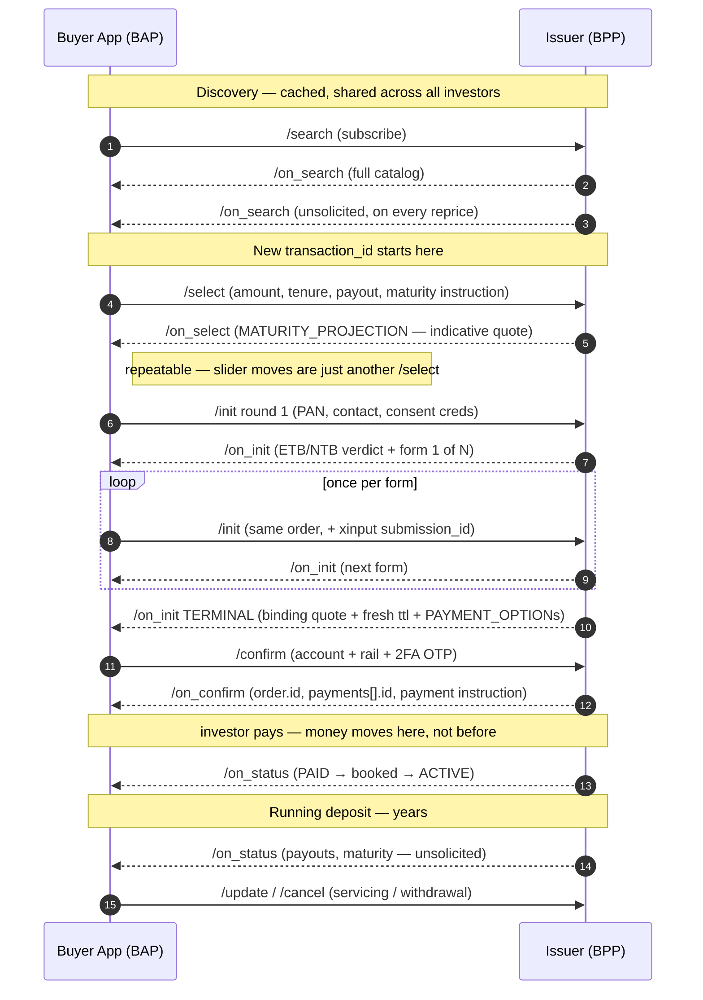

# ONDC FIS15 — Fixed Deposit API Specifications

OpenAPI 3.0 specifications for **fixed-deposit distribution on the ONDC Financial
Services network**: catalog discovery, pricing, investor onboarding, booking,
payment, servicing and premature withdrawal, expressed as beckn actions.

| | |
|---|---|
| Domain code | `ONDC:FIS15` *(requested from ONDC, not yet allocated)* |
| Spec version | `0.2.0` |
| Beckn core | `1.3.0` |
| Error range | `832001`–`832042` *(requested, not yet allocated)* |
| Derived from | `FD_ONDC_BRD_Final.docx` v1.0 · FIS14 (Mutual Funds) v2.1.0 |
| Seller apps in scope | Scheduled Commercial Banks, Small Finance Banks, deposit-accepting NBFCs |

> **Status: draft.** The domain code and the error range are requested and not
> yet allocated. Several design questions are open and are recorded, per spec,
> under `components.x-ondc-fis15.open-points`. See [Open points](#open-points).

---

## Table of contents

- [Why this exists](#why-this-exists)
- [Repository layout](#repository-layout)
- [Getting started](#getting-started)
- [The protocol](#the-protocol)
  - [Beckn in one page](#beckn-in-one-page)
  - [The context object](#the-context-object)
  - [The fourteen endpoints](#the-fourteen-endpoints)
  - [The journey](#the-journey)
  - [Ten rules that explain most of the design](#ten-rules-that-explain-most-of-the-design)
- [API reference](#api-reference)
  - [`/search` → `/on_search` — discovery](#1-search--on_search--discovery)
  - [`/select` → `/on_select` — pricing](#2-select--on_select--pricing)
  - [`/init` → `/on_init` — identity and onboarding](#3-init--on_init--identity-and-onboarding)
  - [`/confirm` → `/on_confirm` — commitment and payment instruction](#4-confirm--on_confirm--commitment-and-payment-instruction)
  - [`/status` → `/on_status` — the lifecycle channel](#5-status--on_status--the-lifecycle-channel)
  - [`/update` → `/on_update` — servicing](#6-update--on_update--servicing)
  - [`/cancel` → `/on_cancel` — withdrawal and cancellation](#7-cancel--on_cancel--withdrawal-and-cancellation)
- [Tag group reference](#tag-group-reference)
- [State machines](#state-machines)
- [Error codes](#error-codes)
- [Open points](#open-points)
- [Conventions for contributors](#conventions-for-contributors)

---

## Why this exists

Fixed deposits are booked today through bank branches, proprietary bank apps, or
closed-network aggregators, each of which is a bilateral integration. The BRD's
value proposition, by participant:

- **Investor** — one discovery surface across every participating issuer, with
  standardised rate, yield, tenure and penalty fields, rather than whichever
  issuers a single platform happens to have integrated.
- **Buyer app** — one protocol integration instead of one custom integration per
  issuer.
- **Seller app (issuer)** — digital liability mobilisation through other apps'
  distribution reach, at a regulated commission, while KYC, AML and fund flow
  control stay with the issuer.
- **Network** — enforced conformance, standardised grievance handling, and a
  common commercial model in place of scattered bilateral arrangements.

All six BRD investor entity types are in MVP scope: individual (resident), joint
holders, minor, HUF, corporate/entity, and NRI.

---

## Repository layout

```
attributes/     14 OpenAPI 3.0 documents — one per beckn action. The source of truth.
examples/       54 worked JSON payloads, one folder per action, referenced by the specs.
bundled/        Generated. attributes/ with the example $refs inlined. Git-ignored.
docs/           FD_ONDC_BRD_Final.docx — the business requirements this spec implements.
scripts/        bundle.mjs — the bundler/validator.
```

### `attributes/` — the specifications

Each file is a self-contained OpenAPI document for one action, and each carries a
vendor extension block at `components.x-ondc-fis15` that holds what an OpenAPI
schema cannot express:

| Key | What it holds |
|---|---|
| `tag-groups` | Every tag group the call may carry: its level (item / fulfillment / payment / order), whether it is mandatory, and every field with its enum |
| `rules` | Normative statements a schema cannot enforce — reconciliation identities, cross-call invariants, what a buyer app must not infer |
| `decisions` | Design decisions with their rationale, including options drafted and discarded |
| `open-points` | Unresolved questions, each with a status and usually a recommendation |
| `shapes` / `rounds` / `variants` / `scopes` / `targets` | The state machine or branch table for calls that have one |
| `error-codes` | Codes allocated by that call, split into `new` and `reused` |
| `source` | Which BRD sections and which FIS14 files the document derives from |

**Read `x-ondc-fis15` before reading the schemas.** The schemas say what is
structurally legal; the extension block says what is correct.

### `examples/` — worked payloads

54 payloads across 14 folders, named `fis15-<action>-<nn>-<what-it-shows>.json`.
They are not filler: each one exercises a distinct branch — a rejection, a rail,
a chain shape, a reconciliation identity. The `/on_search` example encodes a real
ICICI Bank card (44 rate cells across two amount slabs) and is the reference for
how a large rate card is expressed.

---

## Getting started

```bash
npm install          # installs swagger-cli
npm run bundle       # attributes/*.yaml -> bundled/*.yaml, examples inlined
npm run validate     # runs swagger-cli validate over attributes/
```

Then open any file from `bundled/` in [Swagger Editor](https://editor.swagger.io/)
or Redocly.

**Why bundling is needed.** The specs reference example payloads as
`examples[].value.$ref: '../examples/…'`. A `$ref` inside `examples[].value` is
*not* an OpenAPI Reference Object — `value` is free-form data, so a conformant
reader treats `{"$ref": …}` as literal content. `swagger-cli` resolves it anyway
via generic JSON Reference resolution; Swagger Editor and Redocly do not, which
is why examples render empty there. `npm run bundle` resolves them ahead of time.
Internal `#/components/schemas/…` refs are deliberately left alone — editors
resolve those themselves, and inlining would duplicate every schema at each use
site.

**Why `npm run validate` reports failures.** These documents use `const`,
`if`/`then`/`else` and `contains` — JSON Schema keywords that OpenAPI 3.0 does
not admit (they are legal in 3.1). `swagger-cli validate` rejects several files
for that reason alone. It does not affect `$ref` resolution and the bundles
render correctly either way.

---

## The protocol

### Beckn in one page

Every FIS15 interaction is a pair of one-way HTTP POSTs between two network
participants:

- **BAP** (Buyer App Platform) — the app the investor uses. Sends `/search`,
  `/select`, `/init`, `/confirm`, `/status`, `/update`, `/cancel`.
- **BPP** (Buyer-facing Provider Platform, here the **issuer**) — the bank, SFB
  or NBFC-D. Sends the `/on_*` callbacks.
- **Gateway** — broadcasts `/search` to registered BPPs. It is the only action
  where the BAP does not name a specific BPP.

Each POST returns only an **ACK** or **NACK** synchronously. The substantive
answer arrives later as a separate POST to the counterparty's endpoint. Nothing
in FIS15 is request/response in the usual sense.

```
BAP                                        BPP
 |  POST /select  ──────────────────────────>  |
 |  <───────────────────────  200 {ack: ACK}   |
 |                                             |   (issuer prices it)
 |  <──────────────────────────  POST /on_select|
 |  200 {ack: ACK}  ─────────────────────────> |
```

A callback carries **either** `message` **or** `error`, never both. This is
enforced in the schemas with `oneOf`. A rejection is `context` + `error` with no
`message.order` at all — there is no `REJECTED` order status in FIS15, because an
order that was never created has no state.

### The context object

Identical in shape on every call:

```jsonc
{
  "location": { "country": {"code": "IND"}, "city": {"code": "*"} },
  "domain": "ONDC:FIS15",
  "action": "select",
  "version": "0.2.0",              // FIS15 spec version, NOT beckn core (1.3.0)
  "bap_id": "api.buyerapp.com",
  "bap_uri": "https://api.buyerapp.com/ondc",
  "bpp_id": "api.icicibank.com",   // omitted on /search only — gateway broadcast
  "bpp_uri": "https://api.icicibank.com/ondc",
  "transaction_id": "e9895269-…",  // constant for one journey
  "message_id": "37e6d220-…",      // fresh per request/callback pair
  "timestamp": "2026-09-02T09:14:00.000Z",
  "ttl": "PT10M"                   // ISO 8601 duration
}
```

**`city.code` is fixed at `*`.** Digital booking is location-agnostic in MVP.
This is an [open point](#open-points) — some NBFC-D products carry state
restrictions the wildcard cannot express.

**`transaction_id` lifetime is the thing implementers get wrong.** Discovery is
cached and reused across investors, so a booking journey mints a **new**
`transaction_id` at `/select` — it does not inherit the one used to pull the
catalog. From `/select` onward it is constant for the entire life of the deposit,
which may be years: a nominee change three years after booking still carries the
`transaction_id` minted at `/select`.

### The fourteen endpoints

| # | BAP → BPP | BPP → BAP | Purpose |
|---|---|---|---|
| 1 | `/search` | `/on_search` | Pull the FD catalog; subscribe to rate-card changes |
| 2 | `/select` | `/on_select` | Price one configuration. No identity. Repeatable |
| 3 | `/init` | `/on_init` | Identify the investor; walk the onboarding form chain; mint the binding quote |
| 4 | `/confirm` | `/on_confirm` | Commit with 2FA; receive the order id and the payment instruction |
| 5 | `/status` | `/on_status` | Poll (fallback). `/on_status` is also the unsolicited lifecycle channel |
| 6 | `/update` | `/on_update` | Servicing: payment retry, nominee, maturity instruction, documents, abandon |
| 7 | `/cancel` | `/on_cancel` | Quote or execute premature/partial withdrawal, or cancel an unbooked order |

### The journey



### Ten rules that explain most of the design

**1. Tag levels are fixed across the journey.** Every economic figure lives on
the **item**; the investor and servicing live on the **fulfillment**; money
movement lives on the **payment**; and `order.tags` carries `BAP_TERMS` and
`BPP_TERMS` and nothing else, ever.

**2. The name states the authority.** `DEPOSIT_CONFIGURATION` is what the buyer
app *asks for* (`/select`, `/init`). `DEPOSIT_INFORMATION` is what the issuer
*states* (`/on_init` onward, echoed verbatim at `/confirm`). There is no
`DEPOSIT_TERMS` anywhere in FIS15. `/on_select` is the single exception: it
answers with `MATURITY_PROJECTION` alone.

**3. Dates live in `stops`, never in a tag.** `stops[].time` carries the tenure
(`P400D`) before booking, and the real `VALUE_DATE` and `MATURITY_DATE` after it.
Before funding there are no dates at all, because both depend on when the money
lands.

**4. Form content never traverses the protocol.** Address, income, occupation,
nominee details, bank credentials — all submitted to the issuer's own form
system, which returns a `submission_id`. Only the receipt travels. The issuer
returns **masked, display-safe summaries** in `INVESTOR_DETAILS` so the buyer app
can render a confirmation screen. This rule does not lapse after booking: a
nominee change is also a form.

**5. The quote hardens in three stages.** Catalog rate → *indicative* — `/on_select`
quote → *firm arithmetic, still indicative* — terminal `/on_init` quote → **binding,
with a fresh `ttl`**. That last `ttl` is the clock `/confirm` must beat. Restating
the quote only at the terminal round is what stops a ten-minute KYC chain leaving
a daily-repricing issuer holding a stale rate.

**6. Push-first, poll-as-fallback.** `/on_status` fires unsolicited on every
material event. Solicited and unsolicited payloads are **byte-identical in shape**
— a buyer app needs one handler, and must not branch on whether a request
preceded it. See [polling discipline](#polling-discipline).

**7. The payment ledger is append-only.** A refund adds a second `payments` entry
of type `REFUND`; the original stays `PAID`, because it was paid. A retry appends
a new entry; the failed one keeps its `FAILED` status. Nothing is ever rewritten.

**8. No money moves at `/confirm`.** `/confirm` is the commitment. The payment
instruction is issued at `/on_confirm` and the investor pays after that. Placing
payment before `/confirm` is the single most common sequencing error in the
journey.

**9. `order.id` does not exist until `/on_confirm`.** Everything before it is
correlated by `transaction_id` alone — including mid-chain `/on_status` pushes,
which legitimately carry an order with **no id**, and the `/update` that abandons
an unfinished chain.

**10. The browser callback is a UX convenience; `/on_status` is authoritative.**
Redirect rails return the browser to `<bap_uri>/callback`, but that hop can be
lost or tampered with. Never treat it as the outcome.

---

## API reference

### 1. `/search` → `/on_search` — discovery

**FIS15 does not do live search.** The buyer app pulls the whole catalog once and
then stays current. There is no free-text query, no product filter and no
investor context in the intent: rate, tenure and amount filtering all happen
client-side against the cached catalog, because the buyer app needs the whole
rate card to drive a compare-and-slider UX anyway.

The mechanism is inherited from FIS14, but the weight is different. Mutual-fund
attributes change rarely; **FD rate cards reprice on the issuer's schedule, often
daily and sometimes intra-day.** Subscribe is therefore the expected production
mode, and polling is the fallback — the reverse of FIS14's emphasis.

#### Three variants, one action

| Variant | `INCREMENTAL_PULL` | Returns | When |
|---|---|---|---|
| **A — Full pull** | absent | Entire catalog, solicited | Onboarding an issuer; re-baselining a cache you no longer trust |
| **B — Delta pull** | `CHANGES_FROM: <timestamp>` | Items changed since then, solicited | A push was missed; not registered; scheduled pre-market-open refresh |
| **C — Subscribe** | `REGISTER: "true"` | ACK now, then unsolicited `/on_search` on every change | **Steady-state production** |

`CHANGES_FROM` and `REGISTER` are mutually exclusive; sending both is a malformed
intent.

#### `/search` request

`message.intent` is minimal by design:

- `category.descriptor.code` — `FIXED_DEPOSIT` (the only MVP value) or
  `FD_OTHER_SERVICES` (reserved).
- `fulfillment.agent.organization.creds[]` — **treat as mandatory.** The issuer
  cannot decide catalog entitlement without knowing which buyer app is asking,
  and will NACK `832001`. `ONDC_SUBSCRIBER_ID` is always present and matches
  `bap_id`; `DISTRIBUTOR_CODE` is present once the buyer app is empanelled with
  this issuer — its absence is what a first-contact `/search` looks like. Deposit
  distribution has no AMFI-ARN equivalent, so the issuer's own code *is* the
  licensing artefact.
- `tags[]` — `BAP_TERMS` (mandatory on every call in the journey) and optionally
  `INCREMENTAL_PULL`.

`/search` is the only action where `context.bpp_id` and `bpp_uri` are omitted.

#### `/on_search` response

A three-level catalog: category taxonomy → products → the rate card carried as
**repeated tag groups on each product**.

```
catalog
├── descriptor            ISSUER_INFORMATION (provider level)
└── providers[]
    ├── categories[]      FIXED_DEPOSIT → FD_REGULAR, FD_TAX_SAVER, …
    ├── items[]           one per deposit product
    │   ├── PRODUCT_INFORMATION      ×1   bounds, flags, servicing capabilities
    │   ├── RATE_CARD_ENTRY          ×N   one cell per (tenure, amount, category)
    │   ├── RATE_ADJUSTMENT          ×N   optional compression for uplifts
    │   ├── PAYOUT_OPTION            ×N   frequency + its bps adjustment
    │   ├── PREMATURE_WITHDRAWAL_TERMS ×1
    │   ├── PENALTY_TIER             ×N   must tile 0 → TENURE_MAX_DAYS
    │   └── TAX_INFORMATION          ×1
    └── fulfillments[]    VKYC_TERMS
```

**Rate card rules:**

- Cells must **tile the product's full tenure and amount range with no gap and no
  overlap** for each `DEPOSITOR_CATEGORY`. Any (category, amount, tenure) triple
  inside the declared bounds must resolve to exactly one `RATE_CARD_ENTRY`, or to
  one applicable `RATE_ADJUSTMENT` where no explicit category cell exists.
- `RATE_ADJUSTMENT` is **optional compression**. An explicit `RATE_CARD_ENTRY`
  takes precedence. Overlapping adjustments are a catalog defect.
- `PENALTY_TIER` groups must tile `0 → TENURE_MAX_DAYS` with no gap.
- On a delta or unsolicited push the BPP sends the **entire item** — every rate
  cell, every adjustment, every payout option. A partial item is not a valid
  update.

**DICGC disclosure begins at discovery, not at booking.** Where
`ISSUER_INFORMATION.DICGC_INSURED` is `false`, a BAP must display a
deposit-insurance disclosure and should refuse to render the item otherwise. The
RBI-prescribed wording is a network constant, not per-issuer data, which is why
no disclaimer string travels in the payload.

**Servicing capability is advertised here.** `NOMINEE_UPDATE_ALLOWED`,
`MATURITY_INSTRUCTION_UPDATE_ALLOWED`, `DOCUMENT_REQUEST_SUPPORTED` and
`MATURITY_INSTRUCTION_CUTOFF_DAYS` are what `/update` targets are checked against
*before the button is rendered*.

**Cache staleness signals.** `832011` (product not active) and `832013` (no rate
cell matches) on any later call mean the cache is stale — run a delta pull, do
not retry the failed call.

**Scale.** The worked ICICI example is one product with 44 rate cells covering
two amount slabs. An issuer with four slabs plus tax-saver and NRE products could
reach several hundred groups per item. Combined with whole-item pushes on daily
repricing, that is an [open point](#open-points).

---

### 2. `/select` → `/on_select` — pricing

**`/select` carries no identity.** No PAN, no creds, no contact, no form chain.
It is a pricing question about a product, not a booking, and it is safe to send
for a browsing investor who has not signed in. Identity, the ETB/NTB lookup and
the entire onboarding chain moved to `/init` in v0.2.0.

It follows that **`/select` is repeatable and cheap**. Moving the amount slider
or changing the tenure is simply another `/select` — no invariant to violate,
nothing to restart. A buyer app should expect to send several.

#### `/select` request

`message.order` carries exactly one item (capped at one: a deposit is a single
contract, not a cart) and exactly two tag groups:

| Level | Group | Fields |
|---|---|---|
| item | `DEPOSIT_CONFIGURATION` | `PAYOUT_FREQUENCY`, `MATURITY_INSTRUCTION`, `DEPOSITOR_CATEGORY`, `RESIDENCY_STATUS` |
| order | `BAP_TERMS` | `STATIC_TERMS`, `OFFLINE_CONTRACT` |

Amount travels as `items[].quantity.selected.measure` (value + `INR`); tenure as
`fulfillments[].stops[].time.duration` (`P400D`).

**`DEPOSITOR_CATEGORY` travels as a *claim*.** A senior-citizen rate cannot be
quoted without knowing the investor is a senior citizen, but nothing has verified
it yet. The issuer verifies it from the date of birth during KYC at `/init`; a
claim the KYC contradicts is `832014` and invalidates the quote.

Validate client-side before sending: threshold breaches are `832012`; a
configuration falling in no rate cell is `832013` and means the cache is stale.
`PAYOUT_FREQUENCY` must be a `PAYOUT_OPTION` the catalog offers (`832015`) and
`MATURITY_INSTRUCTION` must be supported by the product (`832016`).

#### `/on_select` response

**One group, on the item.** Everything this call says lives in a single
`MATURITY_PROJECTION` group: principal, payout basis, rate, effective yield,
compounding, maturity amount, total interest, and — for a non-cumulative deposit
— the per-payout figures. There is no `DEPOSIT_INFORMATION` here. The buyer app
sent the configuration and does not need it read back; what it needs is the
answer.

**Read `PAYOUT_BASIS` before `MATURITY_AMOUNT`.** The same field name means
principal-plus-interest on a `CUMULATIVE` deposit and principal alone on a
`PERIODIC` one. When `PERIODIC`, `COMPOUNDING_FREQUENCY` is `P0D` and the
per-payout figures must reconcile **exactly**:

```
PAYOUT_COUNT × INTEREST_PER_PAYOUT + FINAL_STUB_INTEREST = TOTAL_INTEREST
```

Send `FINAL_STUB_INTEREST` as `"0"` rather than omitting it.

**Every figure is gross.** No TDS estimate and no net maturity value —
deliberately. The s.194A threshold applies across every deposit the investor
holds with this bank, and at `/on_select` the issuer does not yet know who the
investor is. A tax figure computed on this deposit alone would be confidently
wrong. **A buyer app presenting `MATURITY_AMOUNT` as take-home is mis-selling;**
label it pre-tax and say tax is confirmed at the review screen.

**No dates either.** The deposit is not funded, so there is no value date and no
maturity date. `stops[].time` carries the tenure and only the tenure until
`/on_confirm`.

**Nothing here creates an order.** No `order.id`, no `order.status`. `quote.ttl`
is mandatory — a price with no expiry is not a price when rates move daily — but
the quote is *indicative*. Interest figures belong in `MATURITY_PROJECTION`,
never in `quote.breakup`: breakup lines must sum to `quote.price`, which is what
the investor pays **in**.

The rate returned must be **reproducible** from the catalog the buyer app holds
(`RATE_CARD_ENTRY` + `RATE_ADJUSTMENT` + the `PAYOUT_OPTION` adjustment). A rate
the BAP cannot derive means one of the two caches is stale.

---

### 3. `/init` → `/on_init` — identity and onboarding

**`/init` is called repeatedly within one transaction:** once to identify the
investor against the already-priced configuration, then once per form the issuer
returns. **The seller drives the loop through `xinput`; the buyer app just
answers.**

The deposit is **already priced** when `/init` is sent. Amount, tenure, payout
frequency and maturity instruction were fixed at `/select`. `/init` changes none
of them — it echoes the configuration byte-identically and adds the one thing
`/select` withheld: who the investor is.

#### Two request shapes, and only two

| | Opening round | Rounds 2..n |
|---|---|---|
| `message.order` | Full order | **Byte-identical** to round 1 |
| `xinput` | absent | present, carrying the previous form's `submission_id` |

Nothing else changes between rounds. That invariant is what error `832042`
polices. Within one `transaction_id`, `provider.id`, `items[].id`, amount,
tenure, `fulfillment.id`, `quote.id` and the PAN must all be byte-identical
across every round.

Round 1 adds:

```jsonc
"fulfillments": [{
  "customer": {
    "person": { "id": "pan:abcpk1234f",
                "creds": [{ "id": "ABCPK1234F", "type": "PAN" }] },
    "contact": { "phone": "9876543210" }
  }
}]
```

`quote` carries `id` only, never a price — the buyer app has no business
restating a number the issuer calculated.

**The buyer app does not send the category here.** The PAN's fourth character
gives the holder type, and a core-banking lookup gives the date of birth for an
*existing* customer, so the issuer determines both `INVESTOR_CATEGORY` and
`DEPOSITOR_CATEGORY` and returns them. A PAN carries no date of birth, so for an
**NTB** investor the depositor category is not known until Aadhaar e-KYC
completes — until then the `/select` claim is all there is, and `CATEGORY_BASIS`
says so.

**No consent artefact travels on this call.** The buyer app must still show
`PRODUCT_TNC`, take explicit agreement before sending `/init`, and retain the
time, mode and version of that acceptance in its own records. The issuer assumes
it happened; the protocol carries no proof. (This is an open point.)

#### The reference chain

`head.index` on the callback declares the chain's length up front so the BAP can
render a progress indicator.

| Round | Form | Collects |
|---|---|---|
| 1 | — | ETB/NTB lookup on the PAN |
| 2 | `KYC` (`application/html`) | Aadhaar e-KYC on the issuer's interface. Browser redirect — the outcome arrives twice; **trust the unsolicited `/on_status`** |
| 3 | `INVESTOR_DETAILS` | Address, email, parents' names, marital status, occupation, income. Pre-filled by the issuer from Aadhaar/PAN |
| 4 | `FATCA_CRS` | Tax residency self-certification. Mandatory for every entity type |
| 5 | `NOMINEE` | Nominee details **or** an explicit no-nomination declaration. Skipping is a normal `SUCCESS` submission carrying the declaration, not a distinct protocol state |
| 6 | `BANK_LINKAGE` | Accounts the investor may fund from and be paid into, verified by UPI penny-drop or account + IFSC. *Which* is used is chosen later, at `/confirm` |

`ENTITY_KYC` is an additional mandatory stage when `INVESTOR_CATEGORY` is `HUF`
or `CORPORATE` — the entity's own KYC is separate from the KYC of the Karta or
authorised signatory.

#### `/on_init` — four shapes

| # | Shape | `xinput.required` | `head.index` | Quote | Carries |
|---|---|---|---|---|---|
| 1 | Opening | `true` | `{min:0, cur:0, max:N}` | Indicative, echoed | `INVESTOR_STATUS`, `DEPOSIT_INFORMATION`, form 1 |
| 2 | Chain progression | `true` | `cur` advances by 1 | Indicative, unchanged | Next form; completed stage flips to `SUCCESSFUL` in `ONBOARDING_STATUS` |
| 3 | **Terminal** | `false` | absent | **Binding, fresh `ttl`** | `order.status: CREATED`, `form_response.status: SUCCESS`, no form url, `cancellation_terms`, `refund_terms`, `PAYMENT_OPTION` groups |
| 4 | ETB fast path | `false` | present, optional steps only | **Binding on arrival** | `ETB_CONFIRMED`, existing accounts as repeated `LINKED_BANK_ACCOUNT` groups, `VKYC_REQUIRED: false`, `PAYMENT_OPTION` |

**The gate on `/confirm` is `xinput.required`, not the absence of a form.** A
response can carry `required: false` *and* a form URL — that is an **optional**
step, and the nominee step on the ETB path is exactly that.

**The price is not re-derived mid-chain.** Mid-chain responses echo the
`/on_select` quote id and value unchanged. Only the terminal response may restate
it, and then only with a fresh `ttl`. That `ttl` — not the `/on_select` one — is
the clock `/confirm` must beat.

**No payment object is returned here** and no payment URL exists anywhere in this
call. The terminal round *advertises* which rails the issuer will accept, and at
what amounts, in repeated `PAYMENT_OPTION` groups (`MODE`, `AUTH`, `MIN_AMOUNT`,
`MAX_AMOUNT`, `AVAILABILITY`). `PAYMENT_OPTION` is **mandatory** on the terminal
response — omitting it leaves the buyer app guessing, and the guess fails at
`/on_confirm` with `832029`.

Other invariants: `headings.length` must equal `head.index.max + 1` and `cur`
must never exceed `max`. Every `xinput` heading must be a reportable
`ONBOARDING_STATUS.STAGE`. `INVESTOR_DETAILS` carries **masked values only**, and
only for stages that have succeeded. `ETB_CHECK_PENDING` obliges the BAP to
**wait** for an unsolicited `/on_status` — re-sending `/init` to poll is a
protocol error.

---

### 4. `/confirm` → `/on_confirm` — commitment and payment instruction

#### `/confirm` — the complete statement

A near-verbatim echo of the order agreed at the terminal `/on_init`, plus the
three things that have not appeared before: the **funding account**, the
**payment rail**, and the **2FA OTP**.

In v0.1.0 the account and the rail were asserted at `/init`, one round trip
earlier. They moved here so that everything the investor decides at the point of
paying travels in one call.

**This call restates everything.** The deposit's full terms on the item, the
investor's structural facts and display-safe details on the fulfillment, the
chosen account, and the chosen rail with its amount. That redundancy is the
point: this is the payload both sides sign, and the issuer diffs it against what
it holds. `/on_confirm` answers narrowly by comparison.

**Two things make this the signed agreement, both schema-enforced:**

1. **A 2FA credential** — exactly one of `2FA_PHONE_OTP` or `2FA_EMAIL_OTP`, sent
   on a contact **the issuer holds**, not one the buyer app collected. `creds`
   requires `minItems: 3` with `contains` clauses for `PAN`, `IP_ADDRESS` and one
   2FA type. FIS14 sends an OTP only for instant redemption; FIS15 requires one
   on every booking, because every booking moves investor money into a new
   multi-year liability contract. A mismatch is `832021` and the order is not
   created.
2. **Both terms blocks** — `BAP_TERMS` *and* `BPP_TERMS` side by side in
   `order.tags`, capped at exactly two. Either one alone is not an agreement.

```jsonc
"customer": { "person": { "id": "pan:abcpk1234f", "creds": [
    { "id": "ABCPK1234F",   "type": "PAN" },
    { "id": "49.205.12.88", "type": "IP_ADDRESS" },
    { "id": "418293",       "type": "2FA_PHONE_OTP" }
]}}
```

**Echo rules:**

- `DEPOSIT_INFORMATION` is echoed **in full** — contracted terms *and* the
  figures they produce, exactly as the terminal `/on_init` stated them. The buyer
  app calculates nothing; a differing value is `832042`.
- `INVESTOR_INFORMATION` is echoed from what the **issuer established**, not from
  what the buyer app once claimed. Sending the `/select` claim instead is `832042`
  whenever the two differ — which is precisely the case the check exists to catch.
- `INVESTOR_DETAILS` is echoed **verbatim, masked values and all**. Do not
  unmask, complete or correct it. It is here so the confirmation screen the
  investor saw is part of the signed payload.
- `LINKED_BANK_ACCOUNT` carries `IDENTIFIER` and `ACCOUNT_ROLE` only, and the
  identifier must be one the terminal `/on_init` offered.
- `quote.id` is the one minted on the **terminal** `/on_init`. Not a new one, and
  not the indicative `/on_select` id.
- There is **no `payments[].id`** and **no `payments[].url`** on this call. The
  issuer mints the id at `/on_confirm`; the buyer app never supplies a link.

`PAYMENT_METHOD.MODE` must be one of the advertised `PAYMENT_OPTION` groups and
the amount must sit inside its `MIN_AMOUNT`/`MAX_AMOUNT` — outside is `832029`.
Send inside the terminal `/on_init` `quote.ttl`; after it the answer is `832031`,
and the fix is to **re-send the terminal `/init` round** for a fresh binding
quote, never a `/confirm` retry.

#### `/on_confirm` — four things happen here and nowhere else

1. The order gets its **`id`** (and `payments[].id`). Neither existed before.
2. `order.status` becomes **`ACCEPTED`**.
3. The **payment instruction** is issued.
4. **`cancellation_terms` and `refund_terms`** become binding against a real order
   id — which is what makes them enforceable. `refund_terms` is mandatory
   whenever `VKYC_SEQUENCING` is `POST_PAYMENT`.

The response is deliberately **slim**: `DEPOSIT_INFORMATION`,
`LINKED_BANK_ACCOUNT` and `NOMINEE_INFORMATION` are *not* restated — they were
settled earlier and signed at `/confirm`. A buyer app composes the booking screen
from what it sent plus what arrives here. The one echoed group that survives is
`VKYC_TERMS`, because `VKYC_DEADLINE` becomes a real instant only now.

**Switch on `PAYMENT_METHOD.MODE` to find the instruction. Do not probe fields.**

| Rail | Where the instruction is | What to do |
|---|---|---|
| `NETBANKING` (redirect) | `payments[].url` | Redirect the browser. **Single-use** |
| `UPI` + URI | `payments[].params.url` | A `upi://` **intent string** — render as QR or hand off to a UPI app. Passing it to a browser fails silently |
| `UPI` + COLLECT | `params.source_virtual_payment_address` | Nothing. The issuer sends a collect request; show a waiting state |
| `IMPS` / `NEFT` / `RTGS` (push) | `params.bank_code` + `bank_account_number` | Display beneficiary details. **No URL exists and none should be looked for** — the schema bars one |

**Money moves after this call, not during it.** The order is `ACCEPTED`, the
fulfillment `PENDING`, the payment `NOT-PAID`. The deposit does not exist until an
unsolicited `/on_status` says so.

When the accepted rail differs from the one chosen at `/confirm`, `PAYMENT_ADVICE`
is **mandatory** — substituting silently is a conformance failure. A rejection is
`context` + `error` with no order.

---

### 5. `/status` → `/on_status` — the lifecycle channel

#### `/on_status` — the workhorse

The only call that spans the **entire lifecycle**, from a form receipt during
onboarding to a maturity payout years later. Most of what a buyer app learns
after `/confirm` arrives here, unasked.

**Solicited and unsolicited are the same payload**, deliberately. One handler,
not two. Do not branch on whether a request preceded it.

**`order.id` is conditional**, which surprises people. During the `/init` chain
no order exists, so a form-outcome push carries an order **without an id**,
correlated by `transaction_id` alone. From `/on_confirm` onward the id is
mandatory. The schema enforces this with `if status is not CREATED then id is
required`.

##### Every trigger for an unsolicited push

| Stage | Trigger | `order.id` | Carries |
|---|---|---|---|
| Onboarding | A redirect form completed (KYC, DigiLocker, eSign) | absent | `xinput.form_response` with status + `submission_id` |
| Onboarding | An async ETB check resolved | absent | `INVESTOR_STATUS` with `ETB_CONFIRMED` / `NTB_CONFIRMED` |
| Settlement | Payment succeeded, failed, or is unknown | present | `payments[].status`, `params.transaction_id` once `PAID` |
| Settlement | Payment received, VKYC deferred | present | fulfillment `INITIATED`, VKYC form, `VKYC_DEADLINE` |
| Settlement | Deposit booked in core banking | present | order `ACTIVE`, `EXTERNAL_REFS`, receipt in `documents[]`, **real dates** |
| Settlement | VKYC SLA breached, or booking failed | present | order `CANCELLED`, fulfillment `FAILED`, appended `REFUND` payment |
| Running | A servicing form from `/on_update` resolved | present | `SERVICING_STATUS` → `SUCCESSFUL`/`REJECTED`, the group it updates, `xinput.form_response` |
| Running | An interest payout fell due (non-cumulative) | present | A **child order** with `ref_order_ids` pointing at the parent |
| Running | Maturity, renewal, or a withdrawal settled | present | order `COMPLETED`, or the parent moving to `MATURED` |

**A buyer app that handles only the payment triggers will lose the form outcomes
and the entire post-booking life of the deposit.**

Additional invariants: `if fulfillment state is ACTIVE then stops must contain
VALUE_DATE and MATURITY_DATE` — `ACTIVE` means the deposit exists, and a deposit
that exists has dates. The full order is returned on every push, never a delta.

##### The payment ledger

Append-only. Entries are added, never rewritten.

- The original `PRE_FULFILLMENT` entry keeps its `PAID` status **forever**.
- A refund is a **new entry** with type `REFUND` and its own `transaction_id`.
- Refunds go to the **funding account only**, never to an account supplied after
  the fact. Otherwise `832036`.
- `params.transaction_id` appears once status is `PAID` and is the handle for any
  dispute. **Retain it.**

A refund that mutated the original to a `REFUNDED` state would destroy the record
that money was in fact collected, and would force a status enum extension the
beckn core does not have.

#### `/status` — the smallest call in FIS15

`message` carries an `order_id` and nothing else. No field-scoped variant exists:
a payment-only or VKYC-only request is superficially attractive but forks the
response shape for no gain.

**It is a fallback, not the primary mechanism.** A correctly implemented buyer
app spends most of a deposit's life never calling it. Two constraints shape every
use: there is **no order id until `/on_confirm`**, so nothing before that point is
pollable — including an outstanding `ETB_CHECK_PENDING`, which can only be waited
on — and a deposit runs for years, so frequency must follow the fulfillment state
rather than a fixed timer.

##### Polling discipline

**Legitimate:**

| Trigger | Cadence |
|---|---|
| A browser callback returned but no `/on_status` followed | Wait **30 s**, then one poll. If still `NOT-PAID`, back off. Polling immediately races the push |
| The investor reopens the app mid-journey | One poll to rehydrate the view |
| A VKYC deadline approaching, to refresh the countdown | Hourly at most |
| Portfolio refresh on a running deposit | Daily at most, and only for deposits this buyer app booked |
| Reconciliation after the buyer app was offline | One poll per affected order, **not** a sweep of the whole book |

**Illegitimate:** polling in a loop while waiting for a payment outcome; polling
to discover the ETB/NTB verdict (not even possible — no order id exists); polling
a matured or closed deposit; polling on a fixed timer regardless of state.

**By fulfillment state:** `PENDING` → one poll 30 s after a missed callback, then
exponential back-off · `INITIATED` → hourly inside the VKYC window · `ACTIVE` →
daily at most · `MATURED` / `CLOSED_PREMATURE` / `FAILED` → once, then stop ·
`CANCELLED` → do not poll.

---

### 6. `/update` → `/on_update` — servicing

Everything after `/on_confirm` that is not a poll happens here.

**One target per call.** `message.update_target` names exactly what is being
changed, and the order carries **only** that. This is the inverse of `/confirm`:
there the redundancy is the point because the payload is being signed; here the
point is that a servicing call cannot accidentally restate — and therefore
accidentally alter — anything it was not asked to touch. An order field outside
the declared target is `832042`. The target is a single enum value, never a
comma-separated list.

#### Five targets, and only five

| `update_target` | Job | Carries | 2FA | Applied by | Precondition |
|---|---|---|---|---|---|
| `order.payments` | Fresh payment instruction after failure, expiry, or a spent single-use URL | `payments[]` with `PAYMENT_METHOD`. One entry, no id, no url | ✗ | `/on_update`, immediately | order `ACCEPTED`, fulfillment `PENDING`, else `832039` |
| `order.fulfillments[].tags.NOMINEE_INFORMATION` | Add, change or remove a nominee | Nothing but the fulfillment id and the PAN — **the values are private** | ✗ | An `xinput` form on `/on_update`, then an unsolicited `/on_status`. *The form is the authentication* | fulfillment `ACTIVE` |
| `order.items[].tags.DEPOSIT_INFORMATION` | Change `MATURITY_INSTRUCTION`. Nothing else may move | A **partial** group with `MATURITY_INSTRUCTION` alone, plus 2FA | ✓ | `/on_update`, immediately, with `EFFECTIVE_FROM` | fulfillment `ACTIVE`, inside the cut-off, else `832038` |
| `order.documents` | Request the FD receipt, an interest certificate, or a tax form | `DOCUMENT_REQUEST` on the fulfillment | ✗ | `/on_update`, immediately — `documents[]` with URLs | fulfillment `ACTIVE` / `MATURED` / `CLOSED_PREMATURE` / `SUCCESSFUL` |
| `order.status` | Abandon an onboarding chain the investor will not finish | `status: CANCELLED` + `CANCELLATION_INFO`. **No order id** | ✗ | `/on_update`, immediately and terminally | No order id exists. Against a created order it is `832041` |

**What the call carries depends on whether the value is private.** A maturity
instruction is one enum value and travels here directly. Nominee details are a
name, a relationship and a date of birth — they do **not** travel. `/update` asks
for the nominee journey and `/on_update` answers with a form on the issuer's own
interface, exactly as `/init` does. **The rule that form content never traverses
the protocol does not lapse once the deposit is booked.**

**2FA only where the call *is* the instruction.** Mandatory on the
`DEPOSIT_INFORMATION` target — it is the one target that changes the contract
with no form in between — and forbidden in effect on the others, enforced by an
`if`/`then` rather than by prose.

**`/update` does not cancel a deposit.** `order.status` is a legal target only
for an onboarding chain that never reached `/on_confirm`, where there is no order
id and nothing to unwind. Breaking a booked deposit is a premature withdrawal —
priced, penalised, and handled by `/cancel`.

#### `/on_update` — three shapes, chosen by the buyer app

Which shape arrives is a function of `update_target` alone, never of issuer
preference — so a conformant buyer app knows *before it sends* whether to expect
a completed change or a form.

| # | Shape | Targets | `xinput` | `SERVICING_STATUS` | Carries |
|---|---|---|---|---|---|
| 1 | **Applied** | payments · `DEPOSIT_INFORMATION` · documents · status | absent | `SUCCESSFUL` | The changed thing and nothing else |
| 2 | **Form issued** | `NOMINEE_INFORMATION` | `required: true`, with a form url | `IN_PROGRESS` | The form and the servicing record. Nothing changed yet; the outcome arrives on an unsolicited `/on_status` |
| 3 | **Refused** | any | absent | absent | `context` + `error`, **no** `message.order` |

**`SERVICING_STATUS` is the one group every shape carries.** It repeats, one
group per servicing action, and **accumulates for the life of the deposit** — so
a buyer app can read the whole servicing history off any single response, the way
`ONBOARDING_STATUS` gives it the whole onboarding history. The `REFERENCE` the
issuer mints here is what correlates the later `/on_status` back to this request.

**The response is as narrow as the request.** It does not restate the deposit.
The one asymmetry: `/update` sends a **partial** `DEPOSIT_INFORMATION` and
`/on_update` returns the **full** one — the buyer app is asking, the issuer is
stating, and the issuer always states the contract whole.

**A retry is not a requote.** It mints a new `payments` entry and a new payment
window, and never a new price. `quote.price` is barred from moving; only
`quote.ttl` is fresh. The failed entry keeps its `FAILED` status and the pair is
what a reconciliation reads.

`/on_update` is **never unsolicited** — form outcomes go to `/on_status`, which
is already the unsolicited channel.

---

### 7. `/cancel` → `/on_cancel` — withdrawal and cancellation

Three situations share this call — an order the investor never paid for, an order
they paid for and want out of before it is booked, and a live deposit they want
to break — because all three are the same act at different points on the
timeline, and all three are priced against the same `cancellation_terms` the
issuer published at `/on_confirm`.

#### Two phases, always available, and the first one is free

`cancellation_type: QUOTE` asks what breaking the deposit would cost and **changes
nothing**. `EXECUTE` does it. The BRD requires the penalty to be on screen before
the investor confirms, and a protocol that only offers "cancel now" cannot put it
there. `QUOTE` is repeatable and carries no 2FA — it is a question, not an
instruction, and an OTP demanded to answer a question teaches investors to
approve OTPs for nothing.

#### Three scopes

| `cancellation_scope` | Applies when | Quote needed on EXECUTE | Leaves |
|---|---|---|---|
| `ORDER` | fulfillment `PENDING` (unpaid) or `INITIATED` (paid, not booked) | ✗ | order `CANCELLED`, fulfillment `CANCELLED`. Money collected is refunded as an appended `REFUND` entry, inside `refund_terms.refund_within`. No penalty — the deposit never existed |
| `DEPOSIT_FULL` | fulfillment `ACTIVE` | ✓ | order **`COMPLETED`** (not `CANCELLED`), fulfillment `CLOSED_PREMATURE`, appended `ON_FULFILLMENT` payment for the net payout |
| `DEPOSIT_PARTIAL` | fulfillment `ACTIVE` **and** `PARTIAL_WITHDRAWAL_ALLOWED` | ✓ | order `ACTIVE`, fulfillment `ACTIVE` — **unchanged** — with a reduced principal, restated `DEPOSIT_INFORMATION`, appended `ON_FULFILLMENT` payment |

`COMPLETED`, not `CANCELLED`: the contract ended on terms the contract itself set
out. An early exit is a **priced option**, not an abnormal termination.
`CANCELLED` is reserved for an order whose deposit never existed.

**Partial withdrawal is not a cancellation and is handled here anyway.** The
deposit survives with a smaller principal, so nothing is cancelled in the beckn
sense — but it is priced against the same penalty tiers, authenticated the same
way, and quoted from the same rate card. Splitting it out would duplicate all
three for a naming purity the investor does not experience.

#### `/cancel` request

```jsonc
"message": {
  "order_id": "FD-ICICI-20260902-004481",
  "cancellation_type":  "QUOTE" | "EXECUTE",
  "cancellation_scope": "ORDER" | "DEPOSIT_FULL" | "DEPOSIT_PARTIAL",
  "cancellation_reason_id": "FUNDS_NEEDED_EARLY",   // 7-value enum, mandatory on both types
  "order": { … }
}
```

**Every `EXECUTE` carries 2FA** — `PAN`, `IP_ADDRESS` and exactly one of
`2FA_PHONE_OTP` / `2FA_EMAIL_OTP`, schema-enforced by `minItems` and three
`contains` clauses. A `QUOTE` carries none of them, also schema-enforced. The
flat rule is intentional: making 2FA conditional on how much money moves would
mean an unpaid-order cancellation needs no authentication — and an unpaid order
is still a contract the issuer is holding a rate against, and still someone
else's to end.

An `EXECUTE` on either deposit scope must **echo the quote id** from a `QUOTE`
that has not expired. Scope `ORDER` must **not** carry one — there is nothing to
price, and a quote id there is `832042`. After the ttl elapses the answer is
`832025`, and the fix is a fresh `QUOTE`, not a retry.

Other rules: the scope must match the fulfillment state (`832022`).
`WITHDRAWAL_AMOUNT` equal to the principal is `832024` — a buyer app that means
to close the deposit says `DEPOSIT_FULL`; the issuer does not promote a scope on
its behalf. The payout goes to the `LINKED_BANK_ACCOUNT` of record with role
`PAYOUT` or `BOTH`; there is no field for supplying one, and an issuer asked to
pay elsewhere answers `832036`. This call sends **one** tag group,
`CANCELLATION_REQUEST` on the fulfillment, plus `BAP_TERMS`.

#### `/on_cancel` — three shapes

| # | Shape | Answers | State change | Carries |
|---|---|---|---|---|
| 1 | **Quote** | `QUOTE`, any scope | **none** | `quote` with a **mandatory `ttl`**, `WITHDRAWAL_INFORMATION` on the item, `cancellation_terms`. No payments, no documents, no `CANCELLATION_INFO` |
| 2 | **Executed** | `EXECUTE`, any scope | per the scope table | New state, the appended payment entry, `CANCELLATION_INFO`, `documents[]` with the closure advice, and — on a partial only — restated `DEPOSIT_INFORMATION` |
| 3 | **Refused** | either | none | `context` + `error`, no order |

**How the figure is reached is as important as the figure.** An investor breaking
a deposit is not paying a fee — the interest is **recomputed**, at the card rate
for the tenure actually run rather than the rate they contracted, and *then*
penalised. Someone who sees only a net payout cannot tell a correct computation
from a wrong one, so `WITHDRAWAL_INFORMATION` carries the contracted rate, the
card rate that replaced it, the penalty applied and the interest given up, while
`quote.breakup` carries the money.

Worked example (`fis15-on_cancel-01-withdrawal-quote.json`): contracted at 6.25%,
but 194 days into a 400-day term resolves to the 185–364 day card cell at 5.50%,
less the 50 bps premature-withdrawal penalty → interest recomputed at **5.00%**.
The investor gets ₹13,381.23 instead of the ₹35,163.15 the full term would have
paid, and `INTEREST_FORGONE` says so in one number.

**`quote.price` on this call is the NET PAYOUT to the investor**, inverting its
meaning everywhere else in FIS15, and breakup values are signed. The breakup must
reconcile exactly:

```
PRINCIPAL + INTEREST_ACCRUED + PREMATURE_WITHDRAWAL_PENALTY + TDS
  = NET_PAYOUT = quote.price
```

**`INTEREST_ACCRUED` is signed and goes negative** when a periodic deposit has
already paid out more than the recomputed entitlement — render it as a deduction,
not a credit. (Worked case: ₹2,55,000 already paid against a ₹2,05,684.93
entitlement, so the payout is *less* than the amount withdrawn.)
`PREMATURE_WITHDRAWAL_PENALTY` carries money only for a `FLAT_FEE` penalty; a
`RATE_REDUCTION` is already inside `APPLICABLE_RATE` and stating it again
double-counts it.

`CARD_RATE_FOR_RUN_TENURE` must be **reproducible from the buyer app's cached
rate card**, and `APPLICABLE_RATE` from that plus the `PENALTY_TIER` covering
`RUN_TENURE_DAYS`. A figure the BAP cannot derive means one of the two sides is
wrong, and is worth surfacing rather than rendering.

**A partial withdrawal returns two groups on the item:**
`WITHDRAWAL_INFORMATION` describes what is leaving; `DEPOSIT_INFORMATION`
describes the deposit that remains, restated in full at its new principal with
per-payout figures recomputed. Same rate, same maturity date.

**`/on_cancel` is never unsolicited.** An issuer-initiated cancellation — an
unpaid order expiring, a VKYC SLA breached — arrives on `/on_status` with
`CANCELLATION_INFO` saying `CANCELLED_BY: BPP`.

---

## Tag group reference

Everything FIS15 adds to beckn travels as tag groups. The **level** is fixed and
never varies by call.

### Item level — the deposit's economics

| Group | Where | Notes |
|---|---|---|
| `PRODUCT_INFORMATION` | `/on_search` | Bounds, flags, servicing capabilities, `PRODUCT_TNC` |
| `RATE_CARD_ENTRY` | `/on_search` | Repeated. Must tile the full range with no gap or overlap |
| `RATE_ADJUSTMENT` | `/on_search` | Repeated, optional. Explicit cells take precedence |
| `PAYOUT_OPTION` | `/on_search` | Repeated. Frequency + its bps adjustment |
| `PREMATURE_WITHDRAWAL_TERMS` | `/on_search` | `MIN_LOCKIN_DAYS`, `RATE_BASIS` |
| `PENALTY_TIER` | `/on_search` | Repeated. Must tile 0 → `TENURE_MAX_DAYS` |
| `TAX_INFORMATION` | `/on_search` | TDS section, rates, thresholds, 15G/15H |
| `DEPOSIT_CONFIGURATION` | `/select`, `/init` | **What the buyer app asks for** |
| `MATURITY_PROJECTION` | `/on_select` | The single exception to the two-name rule |
| `DEPOSIT_INFORMATION` | `/on_init`, `/confirm`, `/on_status`, `/update`(partial), `/on_update`, `/on_cancel` | **What the issuer states** |
| `WITHDRAWAL_INFORMATION` | `/on_cancel` | What is leaving, and how the figure was reached |

### Fulfillment level — the investor and the servicing

`INVESTOR_STATUS` · `INVESTOR_INFORMATION` · `INVESTOR_DETAILS` (masked) ·
`ONBOARDING_STATUS` · `SERVICING_STATUS` · `LINKED_BANK_ACCOUNT` ·
`NOMINEE_INFORMATION` · `VKYC_TERMS` · `PAYMENT_OPTION` · `PAYMENT_INSTRUCTION` ·
`PAYMENT_ADVICE` · `EXTERNAL_REFS` · `CANCELLATION_INFO` · `CANCELLATION_REQUEST` ·
`DOCUMENT_REQUEST`

### Payment level

`PAYMENT_METHOD` — `MODE`, `AUTH`.

### Order level — and nothing else, ever

`BAP_TERMS` (buyer app, on every BAP call) and `BPP_TERMS` (issuer, on every
callback). Both fields: `STATIC_TERMS` (uri), `OFFLINE_CONTRACT` (`"true"` /
`"false"`). `/confirm` is the only call carrying both, capped at exactly two.

**Not a tag group:** dates. They live in `stops[].time`.

---

## State machines

### Order status

```
CREATED ──> ACCEPTED ──> ACTIVE ──> COMPLETED   (terminal)
   │            │           │
   └────────────┴───────────┴────> CANCELLED    (terminal)
```

| Status | Meaning |
|---|---|
| `CREATED` | Pre-confirm. **No order id.** Appears on the terminal `/on_init` only |
| `ACCEPTED` | Confirmed; awaiting payment, VKYC or booking |
| `ACTIVE` | The deposit exists and is earning |
| `COMPLETED` | Terminal. Matured, or closed premature on contracted terms |
| `CANCELLED` | Terminal. Funds refunded if collected |

There is **no `REJECTED`** — a rejection uses the error envelope.

### Fulfillment state

| State | Meaning |
|---|---|
| `PENDING` | Order confirmed, payment outstanding |
| `INITIATED` | Paid; awaiting VKYC and/or booking. **The refund window** |
| `ACTIVE` | Booked and earning. `VALUE_DATE` and `MATURITY_DATE` now real |
| `MATURED` | Reached the maturity date |
| `CLOSED_PREMATURE` | Terminated early by a `/cancel`. The order moves to `COMPLETED` |
| `FAILED` | Could not be booked; refund due |
| `CANCELLED` | Cancelled before payment |
| `SUCCESSFUL` | Terminal for one-time fulfillments — payouts, withdrawals, servicing |

**Coupling:**

- Fulfillment `FAILED` or `CANCELLED` → order `CANCELLED`, and collected funds
  must be refunded within `refund_terms.refund_within`.
- Fulfillment `MATURED` with the payout settled → order `COMPLETED`.
- Fulfillment `CLOSED_PREMATURE` → order `COMPLETED`.
- A **partial withdrawal changes no state.** The deposit stays `ACTIVE` with a
  revised principal.

---

## Error codes

Range `832001`–`832042`, requested from ONDC and not yet allocated. Codes marked
*(prose)* are referenced in the specs but not yet formally defined in an
`error-codes` block.

### Empanelment and access — no catalog is coming

| Code | Meaning |
|---|---|
| `832001` | Buyer app not empanelled with this issuer |
| `832002` | Distributor code invalid |
| `832003` | Not authorised for this product |

These are **not retryable per-request failures.**

### Discovery and pricing — usually a stale cache

| Code | Meaning |
|---|---|
| `832004` / `832006` *(prose)* | Investor not eligible for this product (e.g. NRI on a resident FD) |
| `832007` *(prose)* | Malformed PAN. The `/init` schema pattern turns this into a client-side error |
| `832011` | Product not active → **run a delta pull, do not retry** |
| `832012` | Amount or tenure outside `PRODUCT_INFORMATION` bounds. Should have been caught client-side |
| `832013` | No rate card cell matches → **cache is stale, run a delta pull** |
| `832014` | Depositor category contradicted by KYC → **a fresh `/select`, not a retry** |
| `832015` | `PAYOUT_FREQUENCY` is not a `PAYOUT_OPTION` the catalog offers |
| `832016` | `MATURITY_INSTRUCTION` not supported by the product |
| `832017` | Offer expired. **Dead in v0.2.0** — retire it or repoint it at `RATE_CARD_ENTRY.EFFECTIVE_TILL` |

### Booking and payment

| Code | Meaning |
|---|---|
| `832021` | 2FA credential does not match the contact the issuer holds |
| `832029` | Rail is not an advertised `PAYMENT_OPTION`, or the amount is outside its bounds |
| `832030` | Amount does not equal `quote.price.value` |
| `832031` | Terminal `/on_init` `quote.ttl` elapsed → **re-send the terminal `/init` round**, never retry `/confirm` |
| `832033` | Unknown order id, or an order belonging to another investor |
| `832036` | Payout/refund account is not the linked account of record |

### Servicing (`/update`)

| Code | Meaning |
|---|---|
| `832037` | Update target not supported for this order in its current state |
| `832038` | Maturity-instruction change past the issuer's cut-off, or not supported by the product |
| `832039` | No payment retry available — not retryable, or the retry limit is exhausted |
| `832040` | Servicing action not permitted on this product by this issuer |
| `832041` | Abandon refused — an order already exists, or the chain is terminal |

### Cancellation (`/cancel`)

| Code | Meaning |
|---|---|
| `832022` | Not permitted in the order's current state, or the scope does not match the fulfillment state |
| `832023` | Inside the lock-in period (`MIN_LOCKIN_DAYS`, or a tax-saver's `LOCKIN_PERIOD_DAYS`) |
| `832024` | Partial withdrawal refused — unsupported, amount not less than principal, or remainder breaches `AMOUNT_MIN`/`AMOUNT_MULTIPLES` |
| `832025` | Cancellation quote expired or unknown → **re-run the `QUOTE`**, do not retry the `EXECUTE` |
| `832026` | A cancellation is already in progress. Wait for the resolving `/on_status` |

### Cross-cutting

| Code | Meaning |
|---|---|
| `832042` | **The request contradicts what the issuer holds.** The byte-identical invariant across `/init` rounds, a `/confirm` echo that differs from the terminal `/on_init`, an order field outside a declared `/update` target, a quote id on `cancellation_scope: ORDER` |

Codes not yet assigned: `832005`, `832008`–`832010`, `832018`–`832020`,
`832027`–`832028`, `832032`, `832034`–`832035`.

---